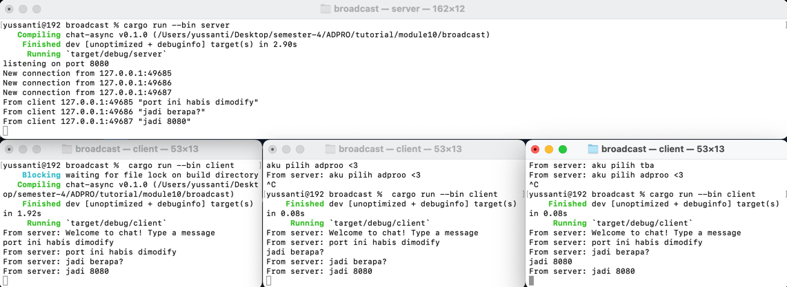
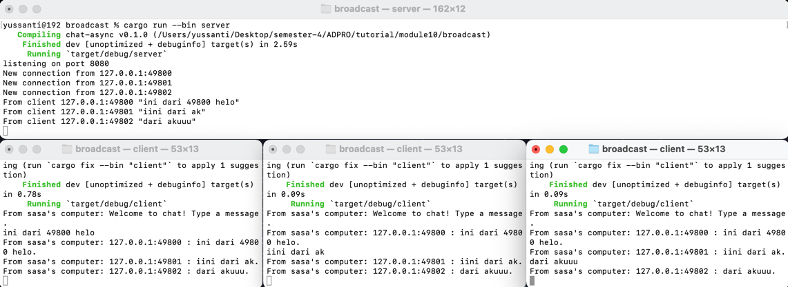

# 😹 Reflection | noitcelfeR 😹

**2.1. Original code of broadcast chat.**

Cara run nya dengan ketik ```cargo run --bin server``` untuk server, lalu 
```cargo run --bin client``` untuk menjalankan client. Nanti pas nulis di client manapun, 
pesannya bakal kekirim ke seluruh client lain kayak di group chat. Hal ini bisa terjadi karena 
penggunaan tokio websockets pada client.rs dan server.rs.

**2.2. Modifying the websocket port**

Cara mengubah portnya yaitu dengan mengubah di bagian ```ClientBuilder::from_uri(Uri::from_static("ws://127.0.0.1:8080"))``` pada client.rs.
Lalu di server.rs diubah pada bagian ```TcpListener::bind("127.0.0.1:8080").await?;
println!("listening on port 8080");```. Setelah portnya diubah, yang berubah hanya portnya saja, selain itu pengiriman pesan antar client terjadi sama seperti sebelumnya.

**2.3: Small changes, add IP and Port**

Yang telah diubah adalah di line 30 server.rs, diubah menjadi ```bcast_tx.send(format!("{addr} : {text}"))?;``` supaya informasi
mengenai ip client juga ikut tersampaikan ketika suuatu client mengirim pesan. 