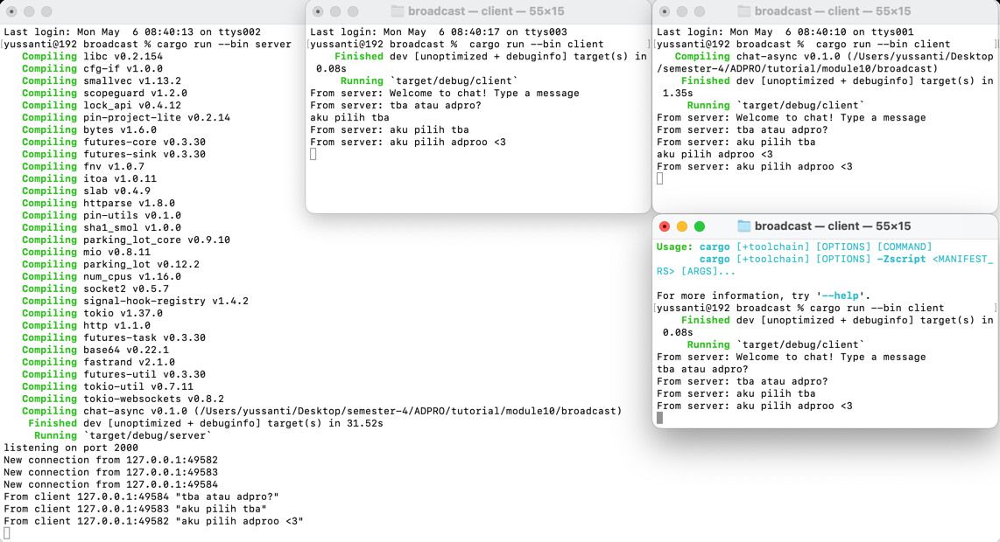

# 😹 Reflection | noitcelfeR 😹


Cara run nya dengan ketik ```cargo run --bin server``` untuk server, lalu 
```cargo run --bin client``` untuk menjalankan client. Nanti pas nulis di client manapun, 
pesannya bakal kekirim ke seluruh client lain kayak di group chat. Hal ini bisa terjadi karena 
penggunaan tokio websockets pada client.rs dan server.rs.
